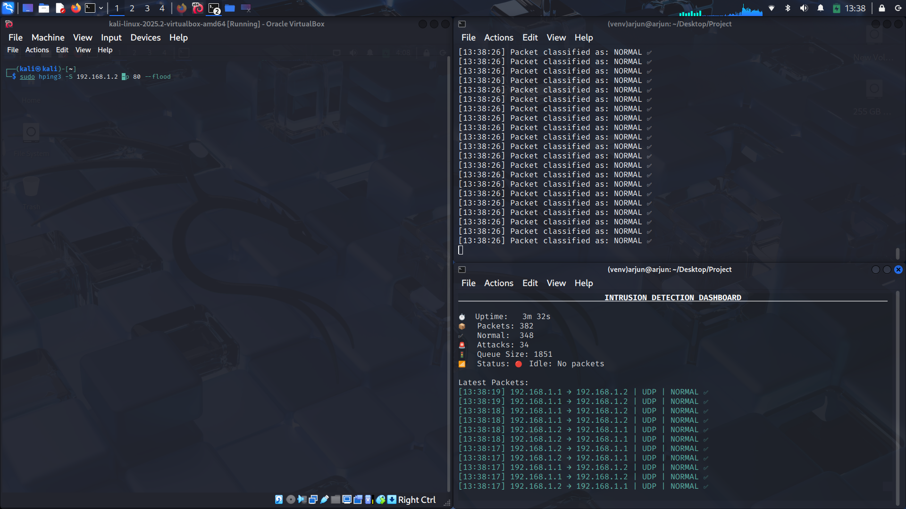
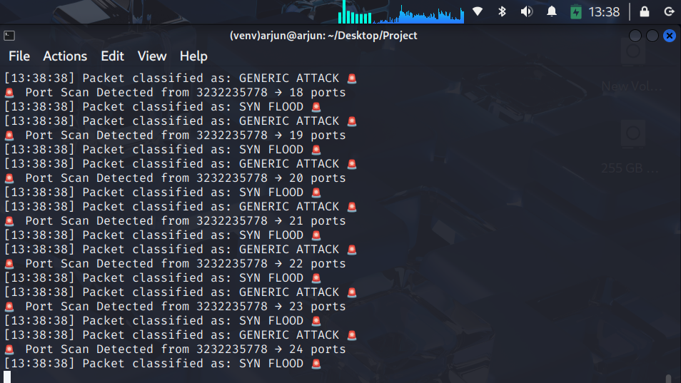
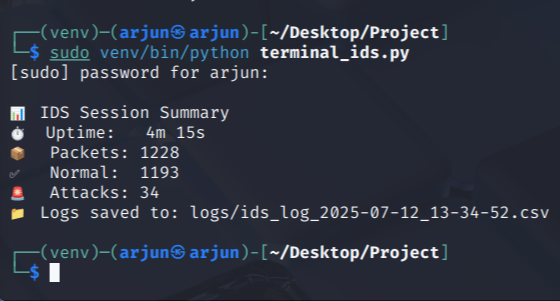

# 🔐 AI-Powered Intrusion Detection System (IDS)
**Intel Unnati Summer Training 2025 — Network Security Project**  
[](LICENSE) 

Developed by: **Arjun Jain**  
Status: ✅ Completed  
Model Accuracy: **100%** (Precision/Recall/F1)  
Interface: Terminal Dashboard  
Attacks Detected: SYN Flood, Port Scan, ICMP/UDP Anomalies, Malformed Packets

---

## 📌 Overview

This is a lightweight, AI-driven **Intrusion Detection System** (IDS) built using:
- 📦 Scapy for real-time packet sniffing
- 🧠 Random Forest ML model
- ⚡ Heuristics for high-speed detection

It can detect:
- 🔥 SYN Floods
- 🛠️ Nmap Port Scans
- 📡 ICMP Floods
- 🌀 Malformed Packets
- 🔍 UDP Scans
- 🐢 Slow stealth probes

A fully interactive **terminal-based live dashboard** displays real-time alerts and logs classified packets with zero external dependencies.

---

## 🧠 ML Model Info

- **Algorithm**: RandomForestClassifier (Scikit-learn)
- **Training Data**: 20K normal, ~18K attack packets
- **Features**: 18 protocol + behavior-based features
- **File**: `data/ids_model_final.pkl`
- 📈 See `data/confusion_matrix.png` for accuracy

---

## 🛑 Supported Attacks

| Attack Type         | Detected? | Simulation Command                          |
|---------------------|-----------|----------------------------------------------|
| 🔥 SYN Flood         | ✅         | `hping3 -S <target> -p 80 --flood`           |
| 🛠️ Port Scan         | ✅         | `nmap -sS <target> -p-`                      |
| 📡 ICMP Flood        | ✅         | `ping -f <target>`                          |
| 🌊 UDP Scan          | ✅         | `nmap -sU --top-ports 20 <target>`          |
| 🌀 Malformed Packets | ✅         | `hping3 -S <target> -p 80 --tcp-timestamp`  |
| 🐢 Slow Stealth Scan | ✅         | `nmap -sS -T2 -p 1-100 <target>`            |

---

## ⚙️ Setup Instructions (Linux / Kali)

> ✅ Tested on Kali Linux 2024.2 and Ubuntu 22.04

### 1️⃣ Clone the Project

```bash
git clone https://github.com/arjunjaincs/ids.git
cd ids
```

### 2️⃣ Create & Activate Virtual Environment

```bash
python3 -m venv venv
source venv/bin/activate
```

### 3️⃣ Install Required Libraries

```bash
pip install -r requirements.txt
```

---

## 🚀 How to Run the IDS

Make sure your **network interface** is correct:

```python
INTERFACE = "wlan0"
```

(Modify this in \`terminal_ids.py\` if needed.)

### ✅ Run the Real-Time Terminal IDS

```bash
sudo venv/bin/python terminal_ids.py
```

This will:
- Start live packet sniffing using Scapy
- Classify traffic as ✅ NORMAL or 🚨 ATTACK
- Display live dashboard and save logs to `/logs/`

---

## 🖼️ Demo
### Normal Working



### Terminal Dashboard under Attack



### Logging



---

## 🧪 Run Test Attacks (from another machine or VM)

Make sure you're on the **same network (e.g., via hotspot)**.

```bash
# 1. 🔥 SYN Flood
sudo hping3 -S <target_ip> -p 80 --flood

# 2. 🛠️ Nmap Port Scan (SYN)
sudo nmap -sS <target_ip> -p-

# 3. 📡 ICMP Flood
ping -f <target_ip>

# 4. 🌊 UDP Port Scan
sudo nmap -sU --top-ports 20 <target_ip>

# 5. 🌀 Malformed Packets
sudo hping3 -S <target_ip> -p 80 --tcp-timestamp --flood

# 6. 🐢 Slow Stealth Scan
sudo nmap -sS -T2 <target_ip> -p 1-100
```

---

## 📁 Log Files

After every session:
- Logs are saved to:  
  - \`logs/ids_log_<timestamp>.csv\`  
  - \`logs/ids_log_<timestamp>.log\`
- A summary header is written to the top of both files
- Logs only store **IP, port, protocol, timestamp, and label**
- ✅ No raw packets or payloads are saved (privacy friendly)

---

## ⚡ Performance Optimizations

To ensure real-time operation and minimal latency, the following enhancements were added to the terminal-based IDS:

- Buffered log writing with auto-flush every second
- Idle-state detection to reduce redraw and CPU usage
- Auto-resize support using curses for stable UI rendering
- Lightweight, efficient feature extraction (18 fields per packet)
- Graceful shutdown with final summary generation
- Timestamped logs with summaries to prevent data loss

---

## 🗂️ Project Structure

```bash
├── terminal_ids.py          # 🖥️ Main real-time IDS dashboard
├── realtime_ids.py          # ⚡ Minimal real-time IDS (fast, no UI/logs)
├── train_model.py           # 🧠 Model training script
├── utils/
│   └── ids_utils.py         # 🔧 Feature extraction & heuristics
├── data/
│   ├── ids_model_final.pkl  # 💾 Trained model
│   └── confusion_matrix.png # 📈 Model evaluation
├── logs/                    # 📁 Logged sessions (auto-created)
├── requirements.txt         # 📦 Dependencies
├── LICENSE                  # 🧾 MIT License
└── README.md                # 📚 You're here!
```

---

## ✨ Credits

Built with 💻 and ☕ by **Arjun**
Intel Unnati Summer Training 2025 — *AI/ML for Networking*

Licensed under the [MIT License](LICENSE)  
